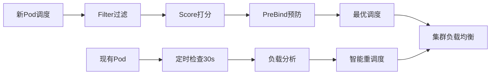

# 🚀 Kubernetes 重调度器插件

## 📋 项目概述

重调度器插件是一个**全生命周期智能调度系统**，提供双重优化模式：

### 🎯 双重优化架构



### ✨ 核心特性

#### 1. 主动调度优化（预防式）
- **Filter过滤**：阻止新Pod调度到过载节点
- **Score打分**：智能选择最优节点
- **PreBind预防**：调度后预防性重调度现有Pod

#### 2. 持续重调度（优化式）
- **负载均衡**：平衡节点间Pod分布
- **资源优化**：基于CPU/内存使用率优化
- **节点维护**：支持节点维护模式

#### 3. 智能协调机制
- **Deployment协调**：与Deployment Controller无冲突协作
- **优雅迁移**：确保服务不中断
- **安全防护**：多重安全检查机制

## 🚀 快速开始

### 1. 基础部署（推荐新用户）
```bash
# 部署重调度器（使用默认配置）
kubectl apply -f manifests/rescheduler/

# 验证部署
kubectl get pods -n kube-system -l app=rescheduler-scheduler

# 查看日志
kubectl logs -n kube-system -l app=rescheduler-scheduler
```

### 2. 测试验证
```bash
# 部署测试工作负载
kubectl apply -f manifests/rescheduler/examples/quick-test.yaml

# 观察重调度行为
kubectl logs -n kube-system -l app=rescheduler-scheduler -f
```

## 📚 详细文档

| 文档 | 说明 |
|------|------|
| [部署指南](./deployment-guide.md) | 完整的部署步骤和环境搭建 |
| [配置参考](./configuration.md) | 详细的配置参数说明 |
| [使用示例](./examples.md) | 各种使用场景的配置示例 |
| [故障排除](./troubleshooting.md) | 常见问题解决方案 |
| [开发指南](./development.md) | 开发和调试指南 |

## ⚙️ 核心配置

### 基础配置示例
```yaml
apiVersion: kubescheduler.config.k8s.io/v1
kind: KubeSchedulerConfiguration
profiles:
  - schedulerName: rescheduler-scheduler
    plugins:
      filter:
        enabled: [name: Rescheduler]
      score:
        enabled: [name: Rescheduler]
      preBind:
        enabled: [name: Rescheduler]
    pluginConfig:
      - name: Rescheduler
        args:
          # 基础重调度配置
          reschedulingInterval: "30s"
          enabledStrategies: ["LoadBalancing", "ResourceOptimization"]
          cpuThreshold: 80.0
          memoryThreshold: 80.0
          
          # 调度优化配置
          enableSchedulingOptimization: true
          enablePreventiveRescheduling: true
```

### 分阶段启用建议
```yaml
# 阶段1：保守模式（仅过滤）
enableSchedulingOptimization: true
enablePreventiveRescheduling: false

# 阶段2：优化模式（过滤+打分）
enableSchedulingOptimization: true
enablePreventiveRescheduling: false

# 阶段3：全功能模式
enableSchedulingOptimization: true
enablePreventiveRescheduling: true
```

## 🎯 使用Pod重调度器

### 指定调度器
```yaml
apiVersion: v1
kind: Pod
metadata:
  name: my-app
spec:
  schedulerName: rescheduler-scheduler  # 使用重调度器
  containers:
  - name: app
    image: nginx:latest
```

### 排除重调度
```yaml
apiVersion: v1
kind: Pod
metadata:
  name: critical-pod
  labels:
    scheduler.alpha.kubernetes.io/rescheduling: "disabled"
spec:
  # ... pod配置
```

### 节点维护模式
```bash
# 启用节点维护模式
kubectl label node worker-1 scheduler.alpha.kubernetes.io/maintenance=true

# 取消维护模式
kubectl label node worker-1 scheduler.alpha.kubernetes.io/maintenance-
```

## 📊 监控和观察

### 关键指标
- 重调度频率和成功率
- 集群负载分布变化
- Pod迁移对应用的影响
- 节点资源利用率

### 日志示例
```
I1201 10:30:15 rescheduler.go:120] 重调度器开始运行 interval=30s
I1201 10:30:45 rescheduler.go:380] 开始执行Pod迁移 pod=default/nginx-abc123 
    sourceNode=worker-1 targetNode=worker-2 reason="负载均衡" strategy=LoadBalancing
I1201 10:31:15 rescheduler.go:445] 成功完成Pod迁移
```

## ⚠️ 重要提醒

### 安全考虑
- 谨慎对有状态应用使用重调度
- 建议先在测试环境验证
- 监控重调度对服务的影响
- 使用RBAC限制权限范围

### 最佳实践
- 根据集群规模调整重调度间隔
- 设置合理的资源阈值
- 限制单次重调度Pod数量
- 排除关键系统Pod

## 🤝 贡献

欢迎贡献代码、报告问题或提出改进建议！

- 📧 Issue: [GitHub Issues](https://github.com/scheduler-plugins/issues)
- 🔧 开发: 参考 [开发指南](./development.md)
- 📖 文档: 帮助改进文档

## 📄 许可证

本项目采用 Apache 2.0 许可证。

---

**快速链接**：[部署指南](./deployment-guide.md) | [配置参考](./configuration.md) | [示例](./examples.md) | [故障排除](./troubleshooting.md)
