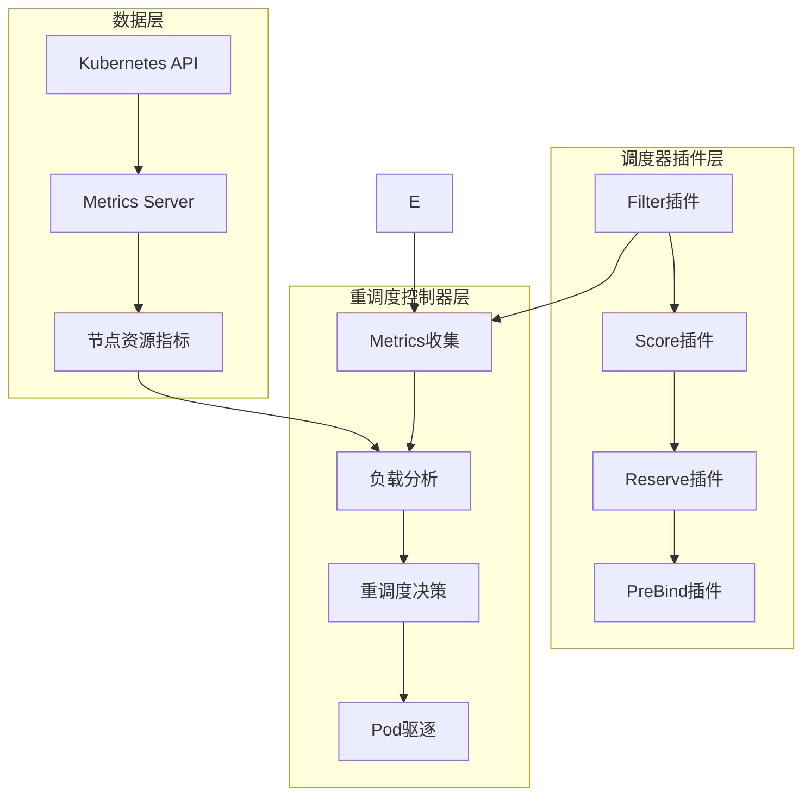

# Kubernetes 重调度器插件

> 🚀 基于负载均衡的智能重调度系统，集成调度器插件和重调度控制器

## 📋 项目概述

Kubernetes重调度器是一个高级调度插件，通过实时监控节点资源使用情况，智能地进行Pod调度和重调度，实现集群资源的最优分配。

### 🎯 核心功能

- **🔍 智能过滤**: 基于实时资源使用率过滤过载节点
- **📊 负载均衡评分**: 优选低负载节点，实现集群负载均衡
- **⚡ 队列优化**: 智能排序调度队列，优先调度小资源需求Pod
- **🛡️ 资源预留**: 预测资源使用，防止节点过载
- **🔄 自动重调度**: 基于Metrics API的实时重调度决策
- **📈 预防性调度**: 在绑定前预测资源使用，避免集群不均衡

### 🏗️ 系统架构



## 🚀 快速开始

### 先决条件

- Kubernetes 1.20+
- Metrics Server 已部署
- scheduler-plugins 镜像

### 一键部署

```bash
# 克隆项目
git clone https://github.com/kubernetes-sigs/scheduler-plugins
cd scheduler-plugins/manifests/rescheduler

# 标准部署
./examples/deploy.sh install

# 生产环境部署
./examples/deploy.sh install -c production -m

# 开发环境部署
./examples/deploy.sh install -c development -m -T
```

### 手动部署

```bash
# 1. 部署RBAC
kubectl apply -f rbac.yaml

# 2. 部署配置
kubectl apply -f config.yaml

# 3. 部署调度器
kubectl apply -f scheduler.yaml

# 4. 验证部署
kubectl get pods -n kube-system -l app=rescheduler-scheduler
```

## 📚 详细文档

### 🔧 配置指南

#### 基础配置参数

| 参数 | 默认值 | 说明 |
|------|--------|------|
| `cpuThreshold` | 80.0 | CPU使用率阈值(%) |
| `memoryThreshold` | 80.0 | 内存使用率阈值(%) |
| `enableSchedulingOptimization` | true | 启用调度优化 |
| `enablePreventiveRescheduling` | true | 启用预防性重调度 |
| `enableReschedulingController` | true | 启用重调度控制器 |
| `reschedulingInterval` | "30s" | 重调度检查间隔 |

#### 评分权重配置

```yaml
# CPU和内存权重配置
cpuScoreWeight: 0.6      # CPU权重(0.0-1.0)
memoryScoreWeight: 0.4   # 内存权重(0.0-1.0)
loadBalanceBonus: 10.0   # 低负载奖励分数(0-50)
```

#### 环境配置模板

我们提供了7种预配置模板：

- **default**: 标准配置，适合大多数场景
- **production**: 生产环境保守配置
- **development**: 开发环境激进配置
- **hpc**: 高性能计算优化配置
- **memory**: 内存密集型优化配置
- **microservices**: 微服务架构配置
- **multitenant**: 多租户环境配置

详细配置请参考 [配置示例](examples/configuration-examples.yaml)

### 🔍 功能详解

#### 1. Filter 节点过滤

```go
// 过滤条件：
// - CPU使用率 > threshold → 拒绝
// - 内存使用率 > threshold → 拒绝  
// - 维护模式节点 → 拒绝
```

**特点**:
- 基于实时资源使用率过滤
- 支持节点维护模式
- 防止Pod调度到过载节点

#### 2. Score 节点评分

```go
// 评分公式：
score = (100 - cpuUsage) * cpuWeight + (100 - memoryUsage) * memoryWeight

// 低负载奖励：
if cpuUsage < 30% && memoryUsage < 30% {
    score += loadBalanceBonus
}
```

**特点**:
- 使用率越低分数越高
- 可调整CPU/内存权重
- 低负载节点额外加分

#### 3. Reserve 资源预留

```go
// 预留检查：
// 1. 预测Pod调度后节点使用率
// 2. 使用率 > 95% → 拒绝调度
// 3. 记录预留信息用于调试
```

**特点**:
- 预测调度后资源使用情况
- 防止严重过载
- 详细的预留日志

#### 4. PreBind 预绑定检查

```go
// 预防性分析：
// 1. 预测Pod调度后使用率
// 2. 超过阈值 → 记录预警日志
// 3. 输出监控指标
```

**特点**:
- 预测性资源分析
- 结构化监控日志
- 不阻塞Pod调度

#### 5. 重调度控制器

```go
// 重调度策略：
// 1. 负载均衡：节点间使用率差异 > 阈值
// 2. 资源优化：节点使用率 > 阈值
// 3. 节点维护：维护模式节点清空
```

**特点**:
- 基于Metrics API获取真实使用率
- 使用Eviction API优雅驱逐
- 智能选择迁移目标节点

### 🧪 测试指南

#### 自动化测试

```bash
# 运行完整测试套件
./examples/automated-test.sh

# 指定命名空间和超时
./examples/automated-test.sh -n test-namespace -t 600

# 详细模式
./examples/automated-test.sh -v
```

#### 功能测试

```bash
# 部署测试应用
kubectl apply -f examples/quick-test.yaml

# 验证调度器功能
kubectl get pods -o wide

# 检查Pod分布
kubectl get pods -o wide | awk '{print $7}' | sort | uniq -c
```

#### 性能测试

```bash
# 运行负载测试
./examples/monitoring.yaml # 获取监控脚本
kubectl exec -it monitoring-pod -- /scripts/load-test.sh default 100
```

### 📊 监控告警

#### Prometheus指标

主要监控指标：

- `scheduler_scheduling_attempt_duration_seconds`: 调度延迟
- `scheduler_schedule_attempts_total`: 调度尝试次数
- `rescheduler_pod_evictions_total`: Pod驱逐次数
- `node_cpu_usage_percent`: 节点CPU使用率
- `node_memory_usage_percent`: 节点内存使用率

#### Grafana仪表板

部署监控组件：

```bash
kubectl apply -f examples/monitoring.yaml
```

包含面板：
- 调度器状态概览
- 调度延迟分布
- 调度成功率
- 重调度统计
- 节点资源使用率
- 插件执行统计

#### 告警规则

预配置告警：
- 调度器离线告警
- 调度延迟过高告警
- 调度失败率告警
- 重调度频率过高告警
- 节点负载不均衡告警

### 🔧 运维指南

#### 健康检查

```bash
# 检查调度器状态
./examples/deploy.sh status

# 查看日志
./examples/deploy.sh logs

# 健康检查脚本
kubectl exec -it monitoring-pod -- /scripts/check-health.sh
```

#### 配置更新

```bash
# 更新配置
kubectl apply -f config.yaml

# 重启调度器应用新配置
kubectl rollout restart deployment -n kube-system rescheduler-scheduler
```

#### 故障排查

1. **调度器无法启动**
   ```bash
   kubectl describe pod -n kube-system -l app=rescheduler-scheduler
   kubectl logs -n kube-system -l app=rescheduler-scheduler
   ```

2. **Pod无法调度**
   ```bash
   kubectl get events --field-selector involvedObject.kind=Pod
   kubectl describe pod <pod-name>
   ```

3. **重调度不生效**
   ```bash
   kubectl top nodes  # 检查Metrics Server
   kubectl get events | grep -i evict  # 检查驱逐事件
   ```

### 🎯 最佳实践

#### 生产环境建议

1. **配置保守**: 使用`production`配置模板
2. **监控完善**: 部署完整监控告警
3. **渐进部署**: 先在测试环境验证
4. **资源限制**: 设置合理的资源请求和限制
5. **排除关键服务**: 将关键服务排除在重调度外

#### 性能优化

1. **调整阈值**: 根据集群特点调整CPU/内存阈值
2. **限制重调度**: 控制单次重调度Pod数量
3. **优化间隔**: 根据集群规模调整检查间隔
4. **权重调优**: 根据工作负载特点调整评分权重

#### 安全考虑

1. **RBAC最小权限**: 仅授予必要权限
2. **网络策略**: 限制调度器网络访问
3. **镜像安全**: 使用可信镜像源
4. **审计日志**: 启用Kubernetes审计日志

## 🛠️ 开发指南

### 本地开发环境

```bash
# 1. 搭建Kind集群
kind create cluster --config examples/kind-config.yaml

# 2. 构建镜像
make build
make image

# 3. 加载镜像
kind load docker-image scheduler-plugins:latest

# 4. 部署测试
./examples/deploy.sh install -c development -m -T
```

### 代码结构

```
pkg/rescheduler/
├── rescheduler.go      # 主插件实现
├── controller.go       # 重调度控制器
└── types.go           # 类型定义

manifests/rescheduler/
├── config.yaml        # 配置文件
├── scheduler.yaml     # 调度器部署
├── rbac.yaml         # RBAC权限
└── examples/         # 示例和工具
    ├── configuration-examples.yaml  # 配置模板
    ├── quick-test.yaml             # 全面测试套件
    ├── monitoring.yaml             # 监控配置
    ├── automated-test.sh          # 自动化测试
    ├── deploy.sh                  # 部署脚本
    └── setup-guide.md            # 搭建指南
```

### 扩展开发

#### 添加新的调度策略

1. 在`rescheduler.go`中添加新的配置参数
2. 在`Score`方法中实现新的评分逻辑
3. 更新配置文件和文档

#### 添加新的重调度策略

1. 在`controller.go`中添加新的分析方法
2. 在`analyzeAndDecide`中调用新方法
3. 添加相应的监控指标

## 📈 路线图

### 已完成功能 ✅

- [x] **调度器插件接口**: Filter + Score + Reserve + PreBind
- [x] **重调度控制器**: 基于Metrics API的自动重调度
- [x] **配置管理**: 多环境配置模板
- [x] **监控告警**: Prometheus + Grafana + AlertManager
- [x] **自动化测试**: 完整的测试套件
- [x] **部署工具**: 一键部署脚本
- [x] **文档完善**: 详细的使用和开发指南

### 开发路径总结

根据你的开发路径，我们已经完成了所有核心功能：

1. ✅ **熟悉调度器框架 API**: 实现了Filter、Score、Reserve、PreBind四个插件接口
2. ✅ **搭建测试环境**: 提供了Kind集群配置和完整的部署指南
3. ✅ **编写Controller**: 实现了基于Metrics API的重调度控制器，使用Eviction API驱逐Pod
4. ✅ **结合调度插件**: 插件和控制器无缝集成，实现智能调度和自动重调度

### 计划中功能 🚧

- [ ] **GPU资源调度**: 支持GPU资源的智能调度
- [ ] **多集群调度**: 跨集群的负载均衡
- [ ] **机器学习优化**: 基于历史数据的智能预测
- [ ] **自定义指标**: 支持自定义业务指标
- [ ] **Web控制台**: 可视化的管理界面

## 🤝 贡献指南

### 如何贡献

1. Fork 项目
2. 创建功能分支 (`git checkout -b feature/AmazingFeature`)
3. 提交更改 (`git commit -m 'Add some AmazingFeature'`)
4. 推送到分支 (`git push origin feature/AmazingFeature`)
5. 创建 Pull Request

### 代码规范

- 遵循Go语言规范
- 添加必要的单元测试
- 更新相关文档
- 确保所有测试通过

## 📄 许可证

本项目基于 [Apache 2.0 许可证](LICENSE) 开源。

## 🙏 致谢

感谢以下项目和社区：

- [Kubernetes](https://kubernetes.io/) - 容器编排平台
- [scheduler-plugins](https://github.com/kubernetes-sigs/scheduler-plugins) - 调度器插件框架
- [Prometheus](https://prometheus.io/) - 监控系统
- [Grafana](https://grafana.com/) - 可视化平台

## 📞 支持

如有问题或建议，请：

1. 查看 [故障排查指南](examples/setup-guide.md#常见问题排查)
2. 提交 [Issue](https://github.com/kubernetes-sigs/scheduler-plugins/issues)
3. 参与 [讨论](https://github.com/kubernetes-sigs/scheduler-plugins/discussions)

---

**🎉 感谢使用Kubernetes重调度器插件！让我们一起构建更智能的Kubernetes调度系统！**
